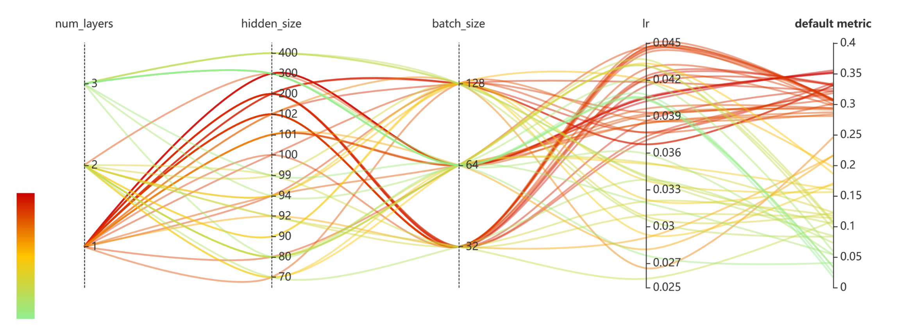
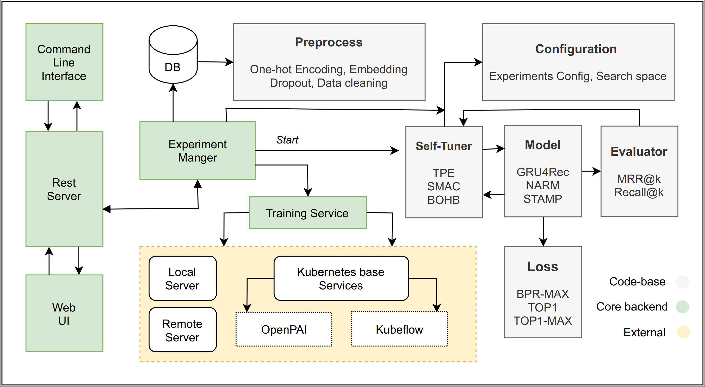
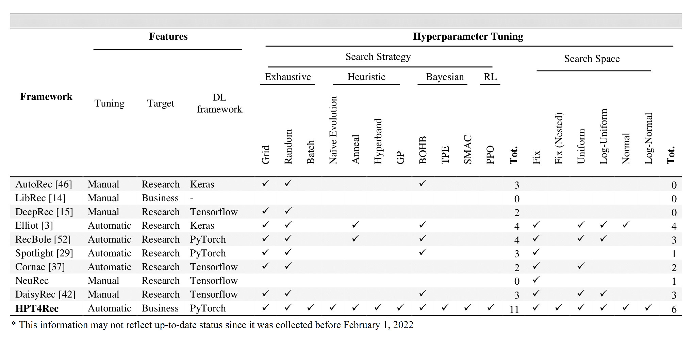

# HPT4Rec
An AutoML based hyperparameter self-tuning framework, with modular code-base designed for session-based recommondation aimed to ease the developing and manipulating process of deep recommonder algorithms. 


<p align="center">

</p>

-----------

[](LICENSE)
<!-- [](https://msrasrg.visualstudio.com/NNIOpenSource/_build/latest?definitionId=62&branchName=master) -->
<!-- [](https://github.com/Microsoft/nni/issues?q=is%3Aissue+is%3Aopen)
[](https://github.com/Microsoft/nni/issues?q=is%3Aissue+is%3Aopen+label%3Abug)
[](https://github.com/Microsoft/nni/pulls?q=is%3Apr+is%3Aopen)
[](https://github.com/Microsoft/nni/releases) [](https://gitter.im/Microsoft/nni?utm_source=badge&utm_medium=badge&utm_campaign=pr-badge&utm_content=badge) -->
[](https://nni.readthedocs.io/en/stable/?badge=stable)

The tool manages automated machine learning (AutoML) experiments, **dispatches and runs** experiments' trial jobs generated by tuning algorithms to search the best neural architecture and/or hyper-parameters in **different training environments** like <a href="https://nni.readthedocs.io/en/stable/TrainingService/LocalMode.html">Local Machine</a>, <a href="https://nni.readthedocs.io/en/stable/TrainingService/RemoteMachineMode.html">Remote Servers</a>, <a href="https://nni.readthedocs.io/en/stable/TrainingService/PaiMode.html">OpenPAI</a>, <a href="https://nni.readthedocs.io/en/stable/TrainingService/KubeflowMode.html">Kubeflow</a>, <a href="https://nni.readthedocs.io/en/stable/TrainingService/FrameworkControllerMode.html">FrameworkController on K8S (AKS etc.)</a>, <a href="https://nni.readthedocs.io/en/stable/TrainingService/DLTSMode.html">DLWorkspace (aka. DLTS)</a>, <a href="https://nni.readthedocs.io/en/stable/TrainingService/AMLMode.html">AML (Azure Machine Learning)</a>, <a href="https://nni.readthedocs.io/en/stable/TrainingService/AdaptDLMode.html">AdaptDL (aka. ADL)</a> , other cloud options and even <a href="https://nni.readthedocs.io/en/stable/TrainingService/HybridMode.html">Hybrid mode</a>.

## **Who should consider using HPT4Rec**

* Those who want to **try different AutoML algorithms** in their training code/model.
* Those who want to run AutoML trial jobs **in different environments** to speed up search.
* Researchers and data scientists who want to easily **implement and experiment new AutoML algorithms**, may it be: hyperparameter tuning algorithm, neural architect search algorithm or model compression algorithm.
* ML Platform owners who want to **support AutoML in their platform**.

<p align="center">

</p>

## **HPT4Rec capabilities in a glance**

HPT4Rec provides CommandLine Tool as well as an user friendly WebUI to manage training experiments. With the extensible API, you can customize your own AutoML algorithms and training services. To make it easy for new users, HPT4Rec also provides a set of build-in state-of-the-art AutoML algorithms and out of box support for popular training platforms.

<p align="center">

</p>

Within the following table, we summarized the current HPT4Rec capabilities, we are gradually adding new capabilities and we'd love to have your contribution.

<p align="center">
  <a href="#nni-has-been-released"></a>
</p>

<table>
  <tbody>
    <tr align="center" valign="bottom">
    <td>
      </td>
      <td>
        <b>Frameworks & Libraries</b>
        
      </td>
      <td>
        <b>Algorithms</b>
        
      </td>
      <td>
        <b>Training Services</b>
        
      </td>
    </tr>
    </tr>
    <tr valign="top">
    <td align="center" valign="middle">
    <b>Built-in</b>
      </td>
      <td>
      <ul><li><b>Supported Frameworks</b></li>
        <ul>
          <li>PyTorch</li>
          <li>Keras</li>
          <li>TensorFlow</li>
          <li>MXNet</li>
          <li>Caffe2</li>
          <a href="https://nni.readthedocs.io/en/stable/SupportedFramework_Library.html">More...</a><br/>
        </ul>
        </ul>
      <ul>
        <li><b>Supported Libraries</b></li>
          <ul>
           <li>Scikit-learn</li>
           <li>XGBoost</li>
           <li>LightGBM</li>
           <a href="https://nni.readthedocs.io/en/stable/SupportedFramework_Library.html">More...</a><br/>
          </ul>
      </ul>
        <ul>
        <li><b>Examples</b></li>
         <ul>
           <li><a href="examples/trials/mnist-pytorch">MNIST-pytorch</li></a>
           <li><a href="examples/trials/mnist-tfv1">MNIST-tensorflow</li></a>
           <li><a href="examples/trials/mnist-keras">MNIST-keras</li></a>
           <li><a href="https://nni.readthedocs.io/en/stable/TrialExample/GbdtExample.html">Auto-gbdt</a></li>
           <li><a href="https://nni.readthedocs.io/en/stable/TrialExample/Cifar10Examples.html">Cifar10-pytorch</li></a>
           <li><a href="https://nni.readthedocs.io/en/stable/TrialExample/SklearnExamples.html">Scikit-learn</a></li>
           <li><a href="https://nni.readthedocs.io/en/stable/TrialExample/EfficientNet.html">EfficientNet</a></li>
           <li><a href="https://nni.readthedocs.io/en/stable/TrialExample/OpEvoExamples.html">Kernel Tunning</li></a>
              <a href="https://nni.readthedocs.io/en/stable/SupportedFramework_Library.html">More...</a><br/>
          </ul>
        </ul>
      </td>
      <td align="left" >
        <a href="https://nni.readthedocs.io/en/stable/Tuner/BuiltinTuner.html">Hyperparameter Tuning</a>
        <ul>
          <b>Exhaustive search</b>
          <ul>
            <li><a href="https://nni.readthedocs.io/en/stable/Tuner/BuiltinTuner.html#Random">Random Search</a></li>
            <li><a href="https://nni.readthedocs.io/en/stable/Tuner/BuiltinTuner.html#GridSearch">Grid Search</a></li>
            <li><a href="https://nni.readthedocs.io/en/stable/Tuner/BuiltinTuner.html#Batch">Batch</a></li>
            </ul>
          <b>Heuristic search</b>
          <ul>
            <li><a href="https://nni.readthedocs.io/en/stable/Tuner/BuiltinTuner.html#Evolution">Naïve Evolution</a></li>
            <li><a href="https://nni.readthedocs.io/en/stable/Tuner/BuiltinTuner.html#Anneal">Anneal</a></li>
            <li><a href="https://nni.readthedocs.io/en/stable/Tuner/BuiltinTuner.html#Hyperband">Hyperband</a></li>
            <li><a href="https://nni.readthedocs.io/en/stable/Tuner/BuiltinTuner.html#PBTTuner">PBT</a></li>
          </ul>
          <b>Bayesian optimization</b>
            <ul>
              <li><a href="https://nni.readthedocs.io/en/stable/Tuner/BuiltinTuner.html#BOHB">BOHB</a></li>
              <li><a href="https://nni.readthedocs.io/en/stable/Tuner/BuiltinTuner.html#TPE">TPE</a></li>
            <li><a href="https://nni.readthedocs.io/en/stable/Tuner/BuiltinTuner.html#SMAC">SMAC</a></li>
            <li><a href="https://nni.readthedocs.io/en/stable/Tuner/BuiltinTuner.html#MetisTuner">Metis Tuner</a></li>
            <li><a href="https://nni.readthedocs.io/en/stable/Tuner/BuiltinTuner.html#GPTuner">GP Tuner</a></li>
            </ul>
          <b>RL Based</b>
          <ul>
            <li><a href="https://nni.readthedocs.io/en/stable/Tuner/BuiltinTuner.html#PPOTuner">PPO Tuner</a> </li>
          </ul>
        </ul>
          <a href="https://nni.readthedocs.io/en/stable/NAS/Overview.html">Neural Architecture Search</a>
          <ul>
            <ul>
              <li><a href="https://nni.readthedocs.io/en/stable/NAS/ENAS.html">ENAS</a></li>
              <li><a href="https://nni.readthedocs.io/en/stable/NAS/DARTS.html">DARTS</a></li>
              <li><a href="https://nni.readthedocs.io/en/stable/NAS/PDARTS.html">P-DARTS</a></li>
              <li><a href="https://nni.readthedocs.io/en/stable/NAS/CDARTS.html">CDARTS</a></li>
              <li><a href="https://nni.readthedocs.io/en/stable/NAS/SPOS.html">SPOS</a></li>
              <li><a href="https://nni.readthedocs.io/en/stable/NAS/Proxylessnas.html">ProxylessNAS</a></li>
              <li><a href="https://nni.readthedocs.io/en/stable/Tuner/BuiltinTuner.html#NetworkMorphism">Network Morphism</a></li>
              <li><a href="https://nni.readthedocs.io/en/stable/NAS/TextNAS.html">TextNAS</a></li>
              <li><a href="https://nni.readthedocs.io/en/stable/NAS/Cream.html">Cream</a></li>
            </ul>
          </ul>
          <a href="https://nni.readthedocs.io/en/stable/Compression/Overview.html">Model Compression</a>
          <ul>
            <b>Pruning</b>
            <ul>
              <li><a href="https://nni.readthedocs.io/en/stable/Compression/Pruner.html#agp-pruner">AGP Pruner</a></li>
              <li><a href="https://nni.readthedocs.io/en/stable/Compression/Pruner.html#slim-pruner">Slim Pruner</a></li>
              <li><a href="https://nni.readthedocs.io/en/stable/Compression/Pruner.html#fpgm-pruner">FPGM Pruner</a></li>
              <li><a href="https://nni.readthedocs.io/en/stable/Compression/Pruner.html#netadapt-pruner">NetAdapt Pruner</a></li>
              <li><a href="https://nni.readthedocs.io/en/stable/Compression/Pruner.html#simulatedannealing-pruner">SimulatedAnnealing Pruner</a></li>
              <li><a href="https://nni.readthedocs.io/en/stable/Compression/Pruner.html#admm-pruner">ADMM Pruner</a></li>
              <li><a href="https://nni.readthedocs.io/en/stable/Compression/Pruner.html#autocompress-pruner">AutoCompress Pruner</a></li>
            </ul>
            <b>Quantization</b>
            <ul>
              <li><a href="https://nni.readthedocs.io/en/stable/Compression/Quantizer.html#qat-quantizer">QAT Quantizer</a></li>
              <li><a href="https://nni.readthedocs.io/en/stable/Compression/Quantizer.html#dorefa-quantizer">DoReFa Quantizer</a></li>
            </ul>
          </ul>
          <a href="https://nni.readthedocs.io/en/stable/FeatureEngineering/Overview.html">Feature Engineering (Beta)</a>
          <ul>
          <li><a href="https://nni.readthedocs.io/en/stable/FeatureEngineering/GradientFeatureSelector.html">GradientFeatureSelector</a></li>
          <li><a href="https://nni.readthedocs.io/en/stable/FeatureEngineering/GBDTSelector.html">GBDTSelector</a></li>
          </ul>
          <a href="https://nni.readthedocs.io/en/stable/Assessor/BuiltinAssessor.html">Early Stop Algorithms</a>
          <ul>
          <li><a href="https://nni.readthedocs.io/en/stable/Assessor/BuiltinAssessor.html#MedianStop">Median Stop</a></li>
          <li><a href="https://nni.readthedocs.io/en/stable/Assessor/BuiltinAssessor.html#Curvefitting">Curve Fitting</a></li>
          </ul>
      </td>
      <td>
      <ul>
        <li><a href="https://nni.readthedocs.io/en/stable/TrainingService/LocalMode.html">Local Machine</a></li>
        <li><a href="https://nni.readthedocs.io/en/stable/TrainingService/RemoteMachineMode.html">Remote Servers</a></li>
        <li><a href="https://nni.readthedocs.io/en/stable/TrainingService/HybridMode.html">Hybrid mode</a></li>
        <li><a href="https://nni.readthedocs.io/en/stable/TrainingService/AMLMode.html">AML(Azure Machine Learning)</a></li>
        <li><b>Kubernetes based services</b></li>
        <ul>
          <li><a href="https://nni.readthedocs.io/en/stable/TrainingService/PaiMode.html">OpenPAI</a></li>
          <li><a href="https://nni.readthedocs.io/en/stable/TrainingService/KubeflowMode.html">Kubeflow</a></li>
          <li><a href="https://nni.readthedocs.io/en/stable/TrainingService/FrameworkControllerMode.html">FrameworkController on K8S (AKS etc.)</a></li>
          <li><a href="https://nni.readthedocs.io/en/stable/TrainingService/DLTSMode.html">DLWorkspace (aka. DLTS)</a></li>
          <li><a href="https://nni.readthedocs.io/en/stable/TrainingService/AdaptDLMode.html">AdaptDL (aka. ADL)</a></li>
        </ul>
      </ul>
      </td>
    </tr>
      <tr align="center" valign="bottom">
      </td>
      </tr>
      <tr valign="top">
       <td valign="middle">
    <b>References</b>
      </td>
     <td style="border-top:#FF0000 solid 0px;">
      <ul>
        <li><a href="https://nni.readthedocs.io/en/stable/autotune_ref.html#trial">Python API</a></li>
        <li><a href="https://nni.readthedocs.io/en/stable/Tutorial/AnnotationSpec.html">HPT4Rec Annotation</a></li>
         <li><a href="https://nni.readthedocs.io/en/stable/installation.html">Supported OS</a></li>
      </ul>
      </td>
       <td style="border-top:#FF0000 solid 0px;">
      <ul>
        <li><a href="https://nni.readthedocs.io/en/stable/Tuner/CustomizeTuner.html">CustomizeTuner</a></li>
        <li><a href="https://nni.readthedocs.io/en/stable/Assessor/CustomizeAssessor.html">CustomizeAssessor</a></li>
        <li><a href="https://nni.readthedocs.io/en/stable/Tutorial/InstallCustomizedAlgos.html">Install Customized Algorithms as Builtin Tuners/Assessors/Advisors</a></li>
      </ul>
      </td>
        <td style="border-top:#FF0000 solid 0px;">
      <ul>
        <li><a href="https://nni.readthedocs.io/en/stable/TrainingService/Overview.html">Support TrainingService</li>
        <li><a href="https://nni.readthedocs.io/en/stable/TrainingService/HowToImplementTrainingService.html">Implement TrainingService</a></li>
      </ul>
      </td>
    </tr>
  </tbody>
</table>

## **Installation**

### **Install**

HPT4Rec supports and is tested on Ubuntu >= 16.04, macOS >= 10.14.1, and Windows 10 >= 1809. Simply run the following `pip install nni` first in an environment that has `python 64-bit >= 3.6`.

Linux or macOS

```bash
python3 -m pip install --upgrade nni
```

Windows

```bash
python -m pip install --upgrade nni
```
And then clone the repositroy in the same folder with nni and change the dataset and configuration as you wish and then just run as follow:

```bash
python experiment.py
```


We encourage researchers and students leverage these projects to accelerate the AI development and research.

## **License**

The entire codebase is under [MIT license](LICENSE)

